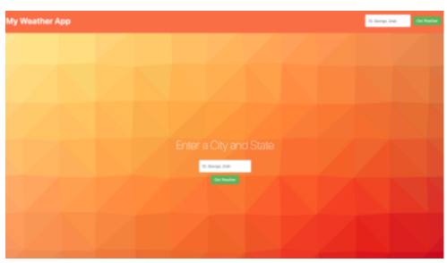
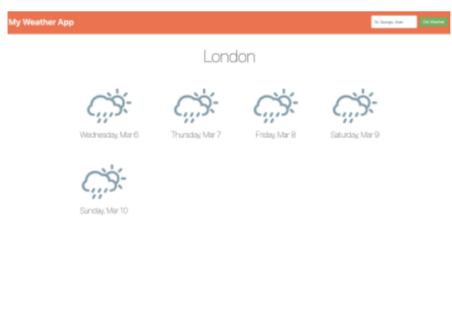
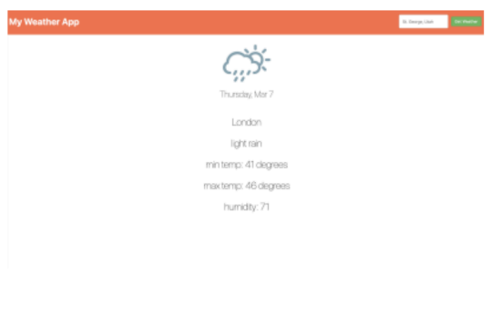

# Weather App

## 1.1 Objective
Build a functioning Weather app using the Open Weather API

The app should provide two basic functionalities:

1. Search for a 5-day weather forecast of a specific city and display the results.
2. Display more details about the weather forecast of one of the days returned on the search when clicking on it

## 1.2 Prototype
The main page displays a header and two search fields with a button to perform the search.

The user is meant to type the name of a city in the input box and click the button.

After clicking on “Get Weather," the next page is displayed with the 5-day forecast:

When clicking on one of the days presented, a detailed forecast for that day is displayed:

## 1.3 Resources
This is the endpoint to retrieve a 5-day forecast for a given city:
https://api.openweathermap.org/data/2.5/forecast/daily?q=CITY-NAME&type=accurate&
APPID=YOUR-API KEY&cnt=5
The API is free - you don't need an API key to use it. However, you may get rate limited
pretty quick, so it's probably worth getting a free API key here. The images to use for the
weather forecasts can be found attached to the email you were sent with this task.

## 1.4 General Instructions
Please provide the solution in an archive together with instructions on how to build and
run it.
- If you believe that the instructions are not precise and you need to make some assumptions please do so but make them clear to us by including them in the instructions sent as part of your solution.
- If you are uneasy about something and would rather ask a question than make an assumption then you can always get in touch.
- The task is simple on purpose - we're sure that apart from applying for this position you still have other things to do in life, like your current job for example, therefore we don't want to ask you to spend unnecessarily long time on solving complex problems.
- We are on the other hand interested in seeing what you consider best software engineering practices so please ensure that your solution could be considered "production ready" and complete.
- You are free to choose the tools and language for your solution. Our preferred technology for front-end development is TypeScript / React / Redux .. but if you are not familiar with these feel free to use what you are familiar with

Please be ready to discuss your task at your interview with the team. How you present the task is
completely your choice, if you choose slides please keep them to a maximum of 4. If you are
planning on submitting your code via GitHub or similar, please ensure relevant documentation and
instructions are included. If you have any questions please contact me and I will be happy to help.

Take a look at our interviewing with TAG webpage, it includes guidance on how you can use AI to
support you with your assessment!
Good luck!